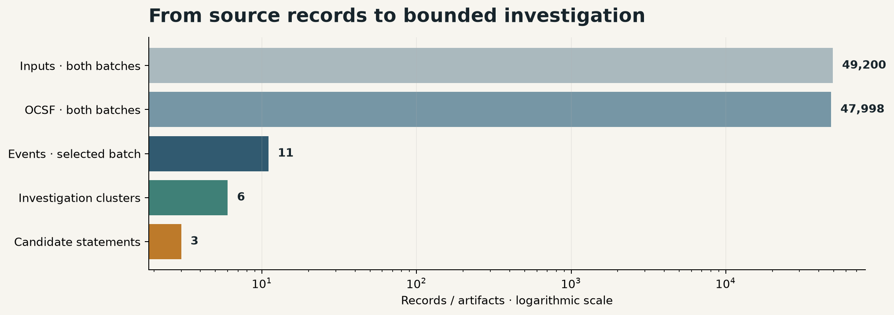

# Lab 01: Continuous risk identification

Build the first stage of an engineered cyber risk lifecycle: a repeatable data pipeline that turns changing system evidence into cited candidate risk statements.

```text
Okta + Zscaler mock records
        ↓
source registry + immutable landing receipt
        ↓
validation + quarantine
        ↓
OCSF 1.8 normalization → Parquet
        ↓
HR + service + objective enrichment
        ↓
DuckDB correlation and bounded clustering
        ↓
agent investigation + explicit dispositions
        ↓
candidate risk statements → human review
```



The important number is not 49,200. It is **six**: code reduces each collection window to six bounded investigation clusters. The model must inspect all six; it is not told which are supported.


## Run locally

Requires Python 3.12.

```sh
python -m venv .venv
# Windows: .venv\Scripts\activate
# macOS/Linux: source .venv/bin/activate
python -m pip install -r requirements.txt
python -m unittest -v
python -m jupyterlab
```

Open `lab-01-continuous-risk-identification.ipynb` and run all cells. The first run deterministically generates:

- 8,000 Okta System Log-shaped records;
- 40,000 Zscaler NSS-shaped web records;
- 1,000 HR worker records;
- 200 business-service context records.

The notebook defaults to replaying saved output from actual bounded model runs over this mock evidence. No key or API charge is required.

For a fresh model run, set `OPENAI_API_KEY` in your terminal environment, set `LIVE = True` in the notebook, and run all cells. Never paste a key into the notebook or repository. Completed identical runs are cached in `runtime/ocsf_history.sqlite`.

## Run with Docker

```sh
docker compose up --build
```

Open the loopback Jupyter URL printed in the container logs. Authentication remains enabled. Generated data and run history use named volumes; code comes from the image, so rebuilding does not leave an older notebook shadowing the new one.

```sh
docker compose down       # retain data and history
docker compose down -v    # deliberately delete them
```

Docker image build, fourteen tests and full notebook replay were verified locally on 2026-09-06. Verification containers had networking disabled and no API key or host mounts. Compose browser startup and repository CI remain unverified. The local Python path has also been executed.

## What the lab teaches

1. Start with a business objective and target-profile outcome.
2. Register every supported source and its role, format, adapter, record ID and batch field.
3. Land source files by content hash and issue a validated ingestion receipt.
4. Quarantine malformed rows and normalize valid security events to OCSF.
5. Keep HR and business context outside the security-event schema.
6. Use DuckDB and Parquet to join and reduce large event volumes into bounded clusters.
7. Give the agent parameterized timeline/context tools—not raw telemetry or arbitrary SQL.
8. Require a disposition for every cluster: candidate, insufficient evidence, contradiction, or ambiguity.
9. Reject invented citations and assessment language in code.
10. Evaluate known synthetic cases and preserve stable scenario IDs across collection batches.

## Evidence states

- `supported`: the narrow retained-access condition has a complete evidence chain.
- `not-supported`: evidence contradicts that condition in this collection window.
- `unknown`: the join is ambiguous or incomplete.

A supported condition is not proof of malicious use or harm. The model adds a plausible threat event and potential consequence as a labeled hypothesis. Every output remains `candidate-human-review-required`.

## Boundaries

- All identities, events, objectives, services, and hostnames are fictional.
- Source records imitate documented vendor shapes; this package is not an Okta or Zscaler connector.
- OCSF makes security events interoperable. It does not identify risk on its own.
- NIST CSF `PR.AA-05` is target-profile context, not a score or maturity rating.
- This lab performs identification only: no likelihood, severity, scoring, priority, treatment, acceptance, or automated risk-register write.
- “Continuous” means repeatable collection batches, stable scenario identity, durable history, and explicit changing evidence state. Scheduling and production pagination are future connector concerns.

## Rebuild and verify

### Risk-identification contracts

`schemas/RiskEvidenceBundle.schema.json` defines scope, cited facts, business context and evidence limitations. The investigation tool returns this validated object without leaking the hidden benchmark disposition.
`schemas/CandidateRiskScenario.schema.json` defines the resulting condition, threat event, potential consequence, statement, citations, assumptions and human review status. Code validates it before persistence.
Both contracts are experimental version 1.0.0. OCSF remains the underlying event schema. HR is optional in the general contract; the currently implemented offboarding rule requires it. The model currently reasons within that selected scenario family.

### Bring your own exports

Prepare a folder containing `raw/okta_system_log.jsonl`, `raw/zscaler_nss_web.jsonl`, `raw/hr_workers.jsonl`, and `context/business_services.json`. Use the generated examples as the current adapter field contract. This is an explicit mapping step, not support for arbitrary vendor exports. Add `_collection.batch_id` to each security event.

```sh
python import_exports.py /path/to/exports /path/to/new-workspace
```

The importer validates JSON, copies files into a new workspace, creates content-addressed landing copies, calculates checksums, counts collection batches and issues `data/landing/ingestion_receipt.json`. Existing destinations are refused and source files remain unchanged. Missing or duplicate source IDs are recorded as envelope warnings for later quarantine; they are not silently cleaned. Then, from Python launched in the lab directory:

```python
from pipeline import correlate
result = correlate(1, root='/path/to/new-workspace')  # local processing only
```

Inspect and minimize sensitive data before explicitly calling `engine.run(1, root=...)`, which sends evidence facts and context to the configured model provider. No model calls are made by the importer. Live connectors and general scenario discovery remain future work.

```sh
python fixture_factory.py
python pipeline.py
python engine.py                # live API calls; requires a private key
python evaluation.py            # evaluate saved real model traces against the reference
python exercise.py              # change source records in a temporary workspace; no API call
python build_notebook.py
python execute_notebook.py
python -m unittest -v
python package_lab.py
```

Key files:

- `fixture_factory.py` — deterministic high-volume vendor-shaped mock sources.
- `config/source_registry.json` — supported source contracts and scenario requirements.
- `ingestion.py` — content-addressed landing, checksums, batch counts and receipt validation.
- `schemas/IngestionReceipt.schema.json` — machine-readable ingestion receipt contract.
- `pipeline.py` — validation, OCSF mapping, Parquet warehouse, DuckDB joins, investigation clusters.
- `engine.py` — LangGraph workflow, bounded investigation tools, abstention, output guardrails, SQLite replay.
- `evaluation.py` and `evals/` — twelve-case synthetic regression benchmark and scorecard.
- `visuals.py` — native Jupyter plots generated from pipeline results.
- `examples/` — saved actual model outputs and inspectable tool traces.
- `test_engine.py` — offline evidence-state, OCSF, guardrail, and replay tests.

## References

- [OCSF schema](https://github.com/ocsf/ocsf-schema)
- [Okta System Log API](https://developer.okta.com/docs/reference/system-log-query/)
- [Zscaler and Cribl deployment guide](https://help.zscaler.com/downloads/zscaler-technology-partners/operations/zscaler-and-cribl-deployment-guide/Zscaler-Cribl-Deployment-Guide-FINAL.pdf)
- [NIST CSF 2.0](https://nvlpubs.nist.gov/nistpubs/CSWP/NIST.CSWP.29.pdf)
- [NIST SP 800-30 Rev. 1](https://nvlpubs.nist.gov/nistpubs/legacy/sp/nistspecialpublication800-30r1.pdf)

## What the current result proves

The saved real model runs close twelve clusters across two batches and match all twelve authored labels. The deterministic reference also matches twelve. This is evidence of known-case agreement, not proof that the model discovers more risks. Its proposed contribution is inspectable investigation and business-language drafting. See SEMANTIC-REVIEW.md for specific wording issues that still require human judgment.

The method is deliberately narrow: a successful authentication and allowed web activity must follow termination and any observed disable. A later disable contradicts current support only within that collection; it does not prove every session was revoked. Web activity is correlated by login and service, not by a shared session identifier. Missing evidence remains unresolved. Expected HR identity never substitutes for an observed identity.

The ingestion receipt proves the identity and contents of a received file. It does not prove the source sent every event. Live polling, source watermarks, late data handling and broader scenario discovery are extension work.

Released under the [MIT License](LICENSE).
