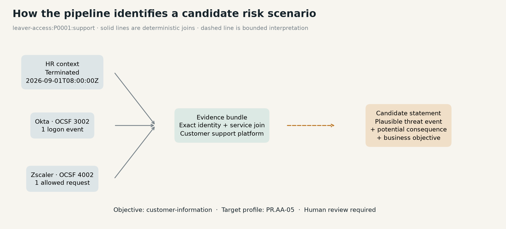

# Lab 01 · Continuous risk identification

This lab is for GRC engineers, security engineers, risk practitioners and technical leaders who want risk identification to operate from evidence—not wait for the next assessment. You will build a repeatable pipeline that joins changing system activity to business context and produces cited candidate risk statements for human review.

The problem it solves: security tools continuously produce events, but a risk register usually records generalized risks by hand. This lab shows how repeated collection can reveal where a risk condition is present, absent or still uncertain as the evidence changes.

## Detection or risk identification?

A SIEM or IGA rule can fire on one event today. That is **detection**.

This lab performs **risk identification** when it:

1. observes a recurring pattern across collection windows;
2. connects the pattern to a business service and objective;
3. preserves the supporting and conflicting evidence; and
4. expresses the result as **condition → threat event → potential consequence**.

That turns operational evidence into a candidate statement about a control deficiency and its business exposure. It does not prove harm, assess likelihood, assign severity or make a risk decision.

“Continuous” means the same pipeline collects the next evidence window, repeats the joins, preserves a stable scenario identity and records whether support for that scenario changed. The lab uses repeatable batches rather than claiming a production streaming service.

## A risk statement produced by the lab

> **Candidate risk statement**
>
> If terminated user P0005 gains access through successful authentication and allowed web use post-termination, then unauthorized access or data exposure may occur, affecting financial-reporting objectives.

| Field | Saved run output |
|---|---|
| Observed condition | A terminated worker’s matching identity authenticated and accessed the financial reporting service after termination. |
| Threat event | Unauthorized access through lingering credentials or access tokens. |
| Potential consequence | Unauthorized access or data exposure affecting the financial reporting workspace. |
| Business objective | Financial reporting |
| Cited evidence | `HR-0005`, `OKTA-P5`, `ZIA-P5` |
| Review state | `candidate-human-review-required` |

This is the exact model-generated statement retained in `examples/batch-1.json`. The shorter observed-condition wording in the table is editorial explanation; the saved source remains unchanged.

## What you will build

```text
Okta + Zscaler-shaped evidence       HR + business context
                \                         /
                 source registration
                         ↓
              content-addressed landing
                         ↓
              validation + quarantine
                         ↓
                 OCSF normalization
                         ↓
             DuckDB correlation + clustering
                         ↓
              bounded LLM investigation
                         ↓
       cited candidate statements → human review
```


The important number is not 49,200 source records. It is **six investigation clusters per collection window**. Deterministic code performs the high-volume processing. The model receives bounded tools and must inspect and close every cluster.



## Why the LLM is here

The LLM is mandatory in the live demonstration because the lesson is the **governance harness around model reasoning**:

- it cannot query arbitrary SQL or read raw telemetry;
- it must use parameterized timeline and business-context tools;
- it must inspect every cluster;
- it must choose one forced disposition;
- submitted statements must cite the exact evidence set;
- code rejects assessment language and unsupported citations;
- every result remains subject to human review.

Lab 01 uses a familiar offboarding risk on purpose. The novelty is not inventing that risk. It is building the evidence pipeline and guardrails before expanding to open-ended discovery in Lab 02.

### Saved model run

- Provider interface: **OpenAI Responses API** (`POST /v1/responses`)
- Exact model snapshot: **`gpt-4.1-mini-2025-04-14`**
- Workflow revision: **`investigation-harness-3`**
- OCSF version: **1.8.0**

Replay mode uses the saved responses and makes no API call. A live run uses the pinned model snapshot above and may vary because model output is not deterministic.

## Run the lab

### Local Python

Requires Python 3.12.

```sh
python -m venv .venv
# Windows: .venv\Scripts\activate
# macOS/Linux: source .venv/bin/activate
python -m pip install -r requirements.txt
python -m unittest -v
python -m jupyterlab
```

Open `lab-01-continuous-risk-identification.ipynb`, select **Restart Kernel and Run All Cells**, and confirm. The notebook defaults to replay mode, so no key or API charge is required.

The first run creates fictional but realistic volumes:

- 8,000 Okta System Log-shaped records;
- 40,000 Zscaler NSS-shaped web records;
- 1,000 HR worker records;
- 200 business-service records.

### Docker

From this lab directory:

```sh
docker compose up --build
```

Open the loopback Jupyter URL printed in the container logs. Authentication remains enabled. To stop it:

```sh
docker compose down       # retain generated data and history
docker compose down -v    # deliberately remove generated volumes
```

Docker image build and full offline notebook replay were verified on 2026-09-06. The current sixteen-test suite also passes locally, including two connector-boundary tests.

## Connect a real API

The included Okta System Log connector is the live ingestion entry point for this scenario. It collects paginated records into the same raw JSONL contract used by the mock source. It does **not** send those records to the LLM.

```sh
export OKTA_DOMAIN="https://your-org.okta.com"
export OKTA_API_TOKEN="set-this-outside-the-repository"
python connectors/okta_system_log.py \
  --since 2026-09-01T00:00:00Z \
  --until 2026-09-02T00:00:00Z \
  --batch-id 1 \
  --output /path/to/new-workspace/raw/okta_system_log.jsonl
```

On PowerShell, use `$env:OKTA_DOMAIN` and `$env:OKTA_API_TOKEN`. The connector enforces HTTPS, follows only same-origin pagination links, caps pages and records, writes through a temporary file, and never logs the token. It is tested with a fake API transport; a live Okta tenant was not used for release validation.

CrowdStrike, Zscaler and other sources should implement the same **collect → raw source contract → landing receipt** boundary. A connector only collects evidence. A scenario pack defines which sources and joins are sufficient to investigate a particular risk condition. CrowdStrike detections alone do not provide every source required by this offboarding scenario.

## Follow the evidence pipeline

1. **Register** each source, its role and its expected record identifiers.
2. **Collect or import** raw evidence without changing source values.
3. **Land** each file by content hash and issue an ingestion receipt.
4. **Validate** rows; quarantine malformed records instead of silently fixing them.
5. **Normalize** valid security events to OCSF while keeping HR and business context separate.
6. **Join and reduce** events into bounded investigation clusters with DuckDB and Parquet.
7. **Investigate** every cluster with constrained model tools.
8. **Validate and persist** candidate statements, abstentions and contradictions.
9. **Repeat** the collection and compare the stable scenario across time.

## Evidence states

- `supported` — the narrow evidence condition is complete in this window;
- `not-supported` — collected evidence contradicts that condition in this window;
- `unknown` — the identity join or activity evidence is incomplete or ambiguous.

Absence of an event does not prove a risk was resolved. An allowed web event does not prove a download, malicious use or shared authenticated session.

## Use your own exported files

Prepare a new folder with `raw/okta_system_log.jsonl`, `raw/zscaler_nss_web.jsonl`, `raw/hr_workers.jsonl`, and `context/business_services.json`. The generated fixtures define the current field contract.

```sh
python import_exports.py /path/to/exports /path/to/new-workspace
```

The importer preserves the source files, lands content-addressed copies, records checksums and produces `data/landing/ingestion_receipt.json`. Then run the deterministic pipeline:

```python
from pipeline import correlate
result = correlate(1, root="/path/to/new-workspace")
```

Inspect and minimize sensitive data before calling `engine.run(...)`, because a live run sends the bounded evidence bundle and business context to OpenAI.

## Verify and rebuild

```sh
python fixture_factory.py
python pipeline.py
python engine.py                # live API calls; requires OPENAI_API_KEY
python evaluation.py
python exercise.py              # mutates temporary mock inputs; no API call
python build_notebook.py
python execute_notebook.py
python -m unittest -v
```

Key implementation files:

- `connectors/` — live collection boundary and connector guidance;
- `config/source_registry.json` — registered evidence sources and scenario requirements;
- `ingestion.py` — content-addressed landing and receipts;
- `pipeline.py` — OCSF mapping, Parquet storage and DuckDB correlation;
- `engine.py` — bounded LangGraph investigation and output enforcement;
- `schemas/` — evidence, ingestion and candidate-statement contracts;
- `examples/` — saved model outputs and complete tool traces;
- `evals/` and `test_engine.py` — regression labels, scorecard and offline tests.

## Boundaries

- Every person, service, objective, hostname and event in replay mode is fictional.
- The live Okta connector is an extension point, not a certified vendor integration.
- File receipts prove what the pipeline received, not that a source supplied every event.
- This scenario uses a known offboarding-risk family; it does not perform open-ended risk discovery.
- Identification stops before likelihood, impact, scoring, prioritization, treatment or acceptance.
- The model matched all twelve authored dispositions, but the deterministic reference did too. The benchmark does not prove model superiority.
- Model wording still requires human judgment; see [SEMANTIC-REVIEW.md](SEMANTIC-REVIEW.md).

## References

- [OCSF schema](https://github.com/ocsf/ocsf-schema)
- [Okta System Log API](https://developer.okta.com/docs/reference/system-log-query/)
- [NIST CSF 2.0](https://nvlpubs.nist.gov/nistpubs/CSWP/NIST.CSWP.29.pdf)
- [NIST SP 800-30 Rev. 1](https://nvlpubs.nist.gov/nistpubs/legacy/sp/nistspecialpublication800-30r1.pdf)

Released under the repository [MIT License](../../LICENSE).
